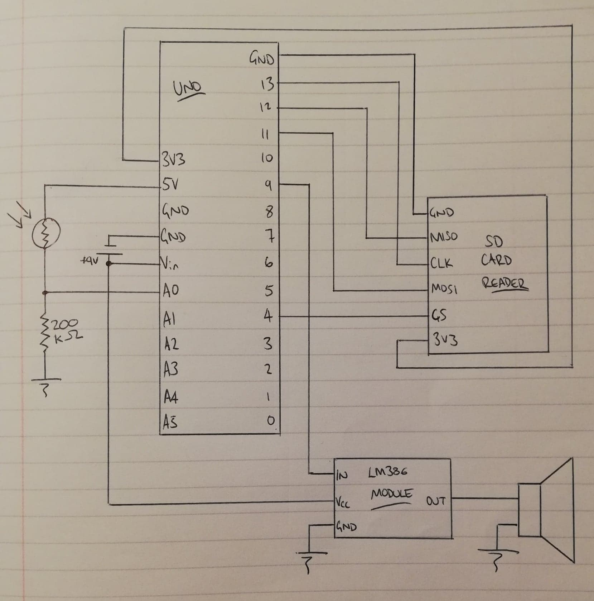

# ABBAd_day

A very stupid project for anyone who has ever wanted 
to make their flatmate's kitchen cupboard play ABBA 
songs whenever they open the door (or any songs really.)

I built (and tested) this project with an Arduino Uno. 

I have uploaded a circuit diagram, such as it is. I used a LM386 module;
you may wish to use the chip itself and a bunch of resistors and capacitors, 
per the data sheet.

## Hardware
* Arduino Uno
* 9V battery and battery clip
* LDR
* 200k resistor
* SD card and SD card reader
* 0.2W speaker
* LM386 amplifier (either as a module, or with RC feedback, per the data sheet)

I set up a volatge divider with the LDR and 200k resistor between 5V and ground.
The voltage input goes into pin A0 on the Arduino.

The amplifier/speaker is connected to pin 9.

The SD card reader is connected as follows:
* MOSI - pin 11 
* MISO - pin 12 
* CLK  - pin 13
* CS   - pin 4 

### Circuit diagram 



## Software
`convert_wav_arduino.py` is a Python script which provides 
two functions. 

The first takes a file which lists a bunch of mp3s 
and converts them to wav files (8-bit, 32kHz, mono wavs, so that
the Arduino can play them).

The second makes another .ino file which contains an array of 
the wav file names.

You can run `convert_wav_arduino.py` from the command line to
execute both of these functions. Use `--help` to see the command
line args.

Note that you'll have to change the array size in `ABBAd_day.ino`
manually until I get round to doing it properly, and update the array
in `fileArray.ino`.

If you want to convert an mp3 to wav manually, use the following command:
```
sox input.mp3 -r 32000 -c 1 -b 8 0.wav
```


## Requirements
* [sox](http://sox.sourceforge.net/)
* [TMRpcm](https://github.com/TMRh20/TMRpcm)
